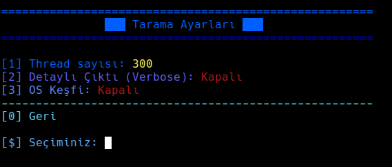
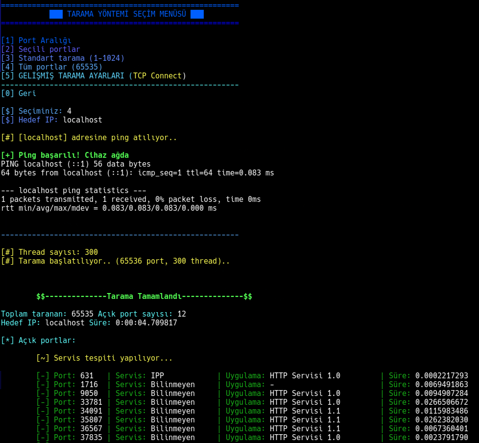
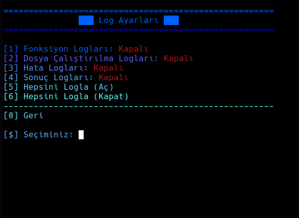

# Vscann

**Vscann** is a Python-based **port and network scanning tool** designed for efficiency and ease of use. It features a modular architecture, multi-threading for high-speed scans, and a localized interface.

---

## ⚠️ Disclaimer
**This tool is for educational and ethical purposes only.**
- Unauthorized testing on systems you do not own or have explicit permission to test is illegal.
- The developer accepts no responsibility for any damage or legal issues caused by misuse of this tool.
- Users should only run this tool in controlled environments.

---

## 🚀 Kullanım (Usage)

Vscann hem interaktif menü hem de CLI (Komut Satırı) desteği sunar.

### 🖼️ Ekran Görüntüleri (Screenshots)

| Log Ayarları (Log Settings) | Tarama Ayarları (Scan Settings) | Log Ayarları (Log Settings) |
| :---: | :---: | :---: |
| | |  |
# Otomatik hedef tespiti ve standart tarama
python3 Vscann.py 192hread sayısı
python3 Vscann.py 192.168.1.5 -p 20-443 -T 500

# Belirli portlar ve JSON çıktı
python3 Vscann.py 127.0.0.1 -p 22,80,443 --json output.json

# UDP taraması ve detaylı (verbose) rapor (Root yetkisi gerekir)
sudo python3 Vscann.py 192.168.1.10 --udp --verbose

# Ağ taraması (CIDR tespiti)
python3 Vscann.py 192.168.1.0/24

### Önemli Parametreler

| Parametre | Açıklama |
| :--- | :--- |
| `target` | Hedef IP, Hostname veya Ağ (192.168.1.1, localhost, 192.168.1.0/24) |
| `-p`, `--port` | Taranacak port veya aralık (Örn: 80, 20-80) |
| `-T`, `--threads` | Thread sayısı (Eşzamanlı tarama hızı) |
| `--timeout` | Soket zaman aşımı süresi |
| `--syn` | TCP SYN (Half-open) taraması (Root) |
| `--udp` | UDP taraması (Root) |
| `--os` | Hedef işletim sistemi tahmini (Fingerprinting) |
| `--json [dosya]` | Sonuçları JSON formatında kaydeder |
| `--verbose` | Açık, kapalı ve filtrelenmiş tüm portları raporlar |
| `--lang [tr/en]` | Uygulama dilini değiştirir |
| `--log [level]` | Log seviyesini ayarlar (Örn: --log error,result) |

---

## Features

- **Multi-threaded Scanning**: High-speed port and network discovery.
- **Localization**: Full support for Turkish and English interfaces.
- **Granular Logging**: Multiple debug levels (Function, Execution, Error, Result) to track and analyze tool behavior.
- **Real-time Progress**: View scan progress percentage at any time by pressing any key during the operation.
- **Service Identification**: Banner grabbing and signature-based service/version detection.
- **Device Identification**: MAC OUI-based vendor detection for network scans.
- **Customizable Themes**: Multiple visual styles (e.g., Blue, Matrix) to suit your preference.
- **Portable**: Built with Python 3, making it compatible with most Linux and Windows environments.

---

## Technical Details

### Logging Levels
Vscann now supports granular logging to help you monitor performance and debug issues:
- **FUNC**: Logs function calls and internal flow.
- **EXEC**: Logs file execution states.
- **ERROR**: Logs exceptions and critical failures.
- **RESULT**: Records the final outcomes of scans.

### Progress Tracking
During long scans, you don't have to wait in the dark. Pressing any key will display the current completion percentage in real-time.

---

## Requirements

- Python 3.7 or higher
- **Scapy** (Needed for advanced scans: SYN, UDP, OS Detection)
- Root privileges (Required for SYN/UDP/Stealth scans and ARP discovery)

## Installation

```bash
git clone https://github.com/midvella/Vscann.git
cd Vscann
pip install -r requirements.txt
python3 Vscann.py
```
